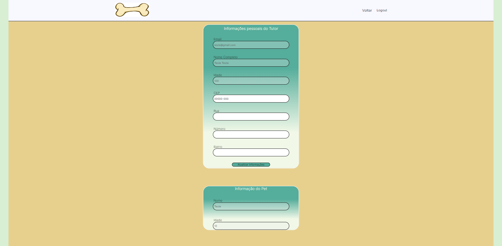

# PetStore, uma aplicação para Pets

Este é um pequeno projeto para exercitar minhas habilidades, utilizando React.js, TypeScript, Axios, Express, Prisma, MongoDB e Sass.
* React, em conjunto com seus Hooks, é utilizado para estruturar e rotear a página.
* TypeScript e Express são usados para criar a lógica, interfaces e o funcionamento das requisições HTTP e respostas.
* Axios é utilizado para lidar com a comunicação entre o back-end e o front-end.
* Prisma facilita nossa interação com os dados enviados para o MongoDB.
* Sass é utilizado para aplicar estilos e cores às páginas.

## Instruções

Para utilizar este projeto, você precisa baixar ou clonar este repositório. Após realizar uma dessas opções, abra o projeto e configure os arquivos `.env` e, se necessário, `prisma/schema.prisma` de acordo com o seu banco de dados para estabelecer a conexão correta. Certifique-se de inserir todos os dados corretamente.

Para rodar a aplicação, execute os seguintes passos no terminal:

1. Execute npm run dev para iniciar o ambiente de desenvolvimento.
2. Execute npm run server para iniciar o servidor Express.
Se precisar visualizar e interagir com os dados de uma forma mais amigável, execute o seguinte comando para abrir o Prisma Studio:

* Execute npx prisma studio para abrir o Prisma Studio e explorar as atualizações de dados em uma interface amigável.

## Endpoints
Alguns Endpoints úteis   | Retornos
--------- | ------
GET: `/users` | Retorna todos os usuários
GET: `/users/:id` | Retorna um único usuário pelo ID
GET: `/orders/:id` | Retorna o(s) pedido(s) pelo ID do usuário
GET: `/orders` | Retorna todos os pedidos

## Imagens





# React + TypeScript + Vite

This template provides a minimal setup to get React working in Vite with HMR and some ESLint rules.

Currently, two official plugins are available:

- [@vitejs/plugin-react](https://github.com/vitejs/vite-plugin-react/blob/main/packages/plugin-react/README.md) uses [Babel](https://babeljs.io/) for Fast Refresh
- [@vitejs/plugin-react-swc](https://github.com/vitejs/vite-plugin-react-swc) uses [SWC](https://swc.rs/) for Fast Refresh

## Expanding the ESLint configuration

If you are developing a production application, we recommend updating the configuration to enable type aware lint rules:

- Configure the top-level `parserOptions` property like this:

```js
export default {
  // other rules...
  parserOptions: {
    ecmaVersion: 'latest',
    sourceType: 'module',
    project: ['./tsconfig.json', './tsconfig.node.json'],
    tsconfigRootDir: __dirname,
  },
}
```

- Replace `plugin:@typescript-eslint/recommended` to `plugin:@typescript-eslint/recommended-type-checked` or `plugin:@typescript-eslint/strict-type-checked`
- Optionally add `plugin:@typescript-eslint/stylistic-type-checked`
- Install [eslint-plugin-react](https://github.com/jsx-eslint/eslint-plugin-react) and add `plugin:react/recommended` & `plugin:react/jsx-runtime` to the `extends` list
